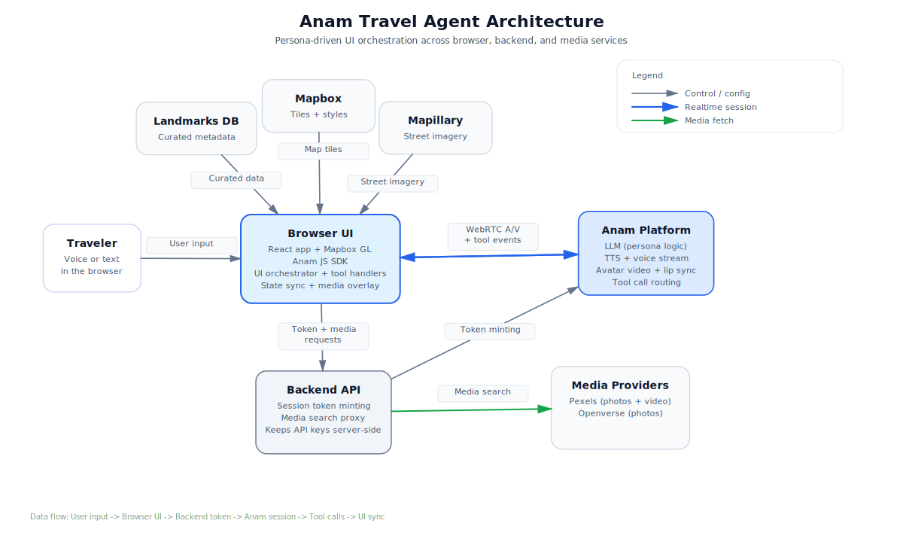

# AI Travel Agent with Synchronized Map Visualization

## Overview

This demo showcases synchronized UI choreography between an Anam persona and a live 3D map. As the persona speaks, the app flies to landmarks, highlights them, and opens contextual panels and media.

## Preview


<video src="Anam-travel-assistant-2.mp4" controls width="720"></video>

If the video does not render on GitHub, use this link and click **View raw** to download: [Watch the demo video](Anam-travel-assistant-2.mp4)

## Architecture



Editable source: `docs/editable-diagram.html`

- Browser UI (React + Mapbox GL) orchestrates map, panels, and media.
- Backend API mints Anam session tokens and proxies media search.
- Anam Platform handles LLM, TTS, avatar video, and tool calls.
- Media providers: Pexels (photos + video) and Openverse (photos).
- Map providers: Mapbox tiles, Mapillary street imagery (optional).

## Prerequisites

1. Node.js (v16+)
2. Anam API key (from lab.anam.ai)
3. Mapbox API token
4. Optional: Pexels API key for live photos/videos
5. Optional: Mapillary token for street imagery

## Setup

### Install dependencies

```bash
cd backend
npm install
cd ../frontend
npm install
```

Or run `.\run-anam-travel.cmd -Install` from the repo root (Windows).

### Configure environment variables

Create `.env` files in `backend/` and `frontend/`:

```bash
# backend
ANAM_API_KEY=your_anam_api_key_here
PORT=3001
CORS_ORIGINS=http://localhost:3000
PHOTO_PROVIDER=auto
VIDEO_PROVIDER=pexels
PEXELS_API_KEY=

# Optional provider overrides
OPENVERSE_API_URL=https://api.openverse.org/v1/images
OPENVERSE_LICENSE_TYPE=all
PEXELS_API_URL=https://api.pexels.com/v1/search
PEXELS_VIDEO_API_URL=https://api.pexels.com/videos/search

# frontend
VITE_MAPBOX_TOKEN=your_mapbox_token_here
VITE_BACKEND_URL=http://localhost:3001
VITE_CITY=tunis
VITE_DEMO_MODE=true
VITE_TOOL_FALLBACK=false
VITE_MAPILLARY_TOKEN=
VITE_LIVE_PHOTOS=false
VITE_PHOTO_PROVIDER=auto
VITE_VIDEO_PROVIDER=pexels
```

Notes:
- Set `VITE_CITY` to `tunis` or `istanbul` to choose the default city.
- Set `VITE_MAPILLARY_TOKEN` to enable street-level imagery.
- Set `VITE_LIVE_PHOTOS=true` to fetch live media.
- Keep `PHOTO_PROVIDER` and `VITE_PHOTO_PROVIDER` aligned when using live photos.
- Video search is currently supported via Pexels (`VIDEO_PROVIDER=pexels`).

## Running

1. Start backend and frontend:
   - `.\run-anam-travel.cmd` (Windows), or
   - `npm start` in `backend/` and `npm run dev` in `frontend/`
2. Open http://localhost:3000
3. Click "Start Your Journey"
4. Ask Sofia about a city or landmark

### Example queries

- "Tell me about Tunis"
- "What can I see in the Medina?"
- "Tell me about the ancient ruins of Carthage"
- "What's the most beautiful spot in Tunis?"
- "I'm interested in historical sites"

## How synchronization works

### Tool calls drive the UI

The persona is configured with Client Tools. When Sofia decides to highlight a landmark, she calls a tool like `fly_to_landmark`, `show_landmark_panel`, or `show_media`.

```javascript
client.addListener(AnamEvent.CLIENT_TOOL_EVENT_RECEIVED, (event) => {
  // eventData can be a JSON string, so normalize before passing along.
  orchestrator.handleToolCall(event.eventName, event.eventData);
});
```

If your SDK still emits `TOOL_CALL`, register that event too and pass the same handler.

### Real-time speech tracking

The UI reacts to speech state for indicators and interruptions.

```javascript
client.addListener(AnamEvent.MESSAGE_STREAM_EVENT_RECEIVED, (event) => {
  if (event.type === 'persona') {
    setPersonaState('speaking');
  }
});
```

### Synchronized UI updates

The orchestrator performs the actual choreography.

```javascript
await orchestrator.handleToolCall('fly_to_landmark', { id: 'medina', zoom: 15 });
```

## Media behavior

- Curated media and search hints live in `frontend/src/data/landmarks_db.json`.
- Landmarks can define `imageUrls`, `videoUrl`, `photoQuery`, `videoQuery`, `videoInclude`, `videoExclude`, and `photoExclude`.
- When `VITE_LIVE_PHOTOS=true`, the frontend merges live results from `/api/photos` and `/api/videos` with the curated URLs.
- If live search returns nothing, the UI falls back to curated media.

## Customization

### Adding new locations

Edit `frontend/src/data/landmarks_db.json`:

```json
{
  "paris": {
    "city": {
      "name": "Paris",
      "coordinates": [2.3522, 48.8566],
      "zoom": 12
    },
    "landmarks": [
      {
        "id": "eiffel-tower",
        "name": "Eiffel Tower",
        "coordinates": [2.2945, 48.8584],
        "description": "Iconic iron lattice tower...",
        "zoom": 16
      }
    ]
  }
}
```

### Customizing the persona

Update the system prompt and persona config in `frontend/src/components/TravelAgentDemo.tsx`.

## Troubleshooting

### Map not rendering

1. Verify the Mapbox token is present and valid.
2. Check browser console for errors.
3. Ensure hardware acceleration is enabled if the map appears black.

### Anam connection issues

1. Confirm the backend is running and reachable at `VITE_BACKEND_URL`.
2. Verify `ANAM_API_KEY` and CORS settings.
3. Check the browser console for WebRTC errors.

### Media relevance issues

1. Tune `photoQuery` and `videoQuery` per landmark.
2. Update `videoInclude`/`videoExclude` and `photoExclude` to filter noisy results.

## Roadmap

1. Expand curated media coverage with verified, relevant sources.
2. Improve media relevance filters per landmark.
3. Add additional cities and landmark packs.
4. Layout modes for intro, tour, and wrap-up states.
5. Preference-driven itineraries (vibe, walking level, budget).
6. Optional low-bandwidth / map-performance presets.

## License

MIT License - Feel free to use and modify

## Credits

- Anam AI for persona technology
- Mapbox for mapping platform
- OpenStreetMap for geographic data
- Openverse for live photo search
- Pexels for live photo and video search
- Landmark photos and attribution details in `docs/ASSETS.md`
